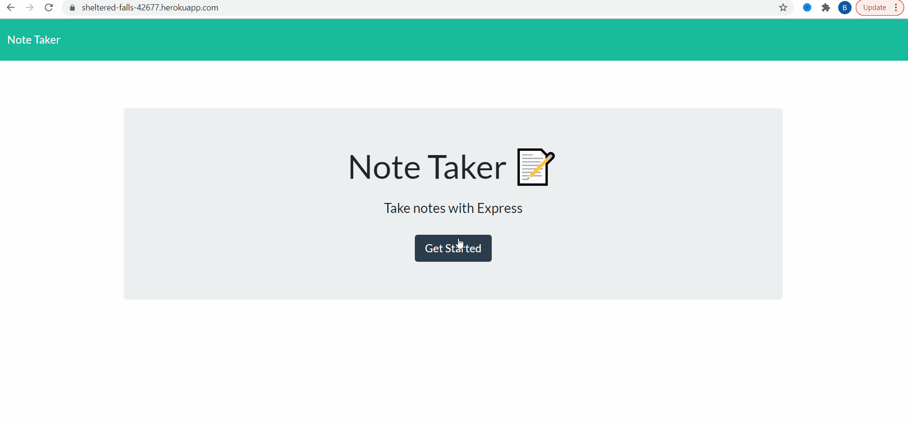

# Note-Taker

## Description

The user can add and save notes, review notes they've saved already, and delete notes.

## Technologies Used

HTML5, CSS3, Bootstrap3, JavaScript, jQuery, node.js, express.js

## Walkthrough

## Links

### Heroku Deployment Link

https://sheltered-falls-42677.herokuapp.com/

### Github Repo
https://github.com/Bryan-Thaoxaochay/Note-Taker 

## What I Learned

### List
1. HTTP Methods 

I got practice with the GET, POST, and DELETE methods. I learned how they work, specifically the importance of the request and response objects.

2. Modularity

Through separation of concerns, the directory of the app looks more organized and clean. Along with that, it allowed code to be changed that didn't affect other files. Lastly, it made the code in the files cleaner, since necessary code could just be exported and imported.

3. Routing

Since there was separation of concerns, routing was very important. The most difficult task for this assignment was the routing. In the end, I realized how important the path module is and how it made my life a lot easier.

4. Heroku Deployment

This is my first Heroku app that is going to be deployed, and it was a process learning how to do it. Heroku is just another useful technology to use, and I am still learning it's full capabilities.

5. Creating Gifs

This is the first time I created a gif and uploaded it to the README. It makes it easier to see what the app does. For Windows, I used Screentogif which was downloaded from the Microsoft store. I added it to my images folder and routed it into the here. It is above under "Walkthrough".

## Contact Information

Email: bthaoxaochay@gmail.com
GitHub: https://github.com/Bryan-Thaoxaochay 
